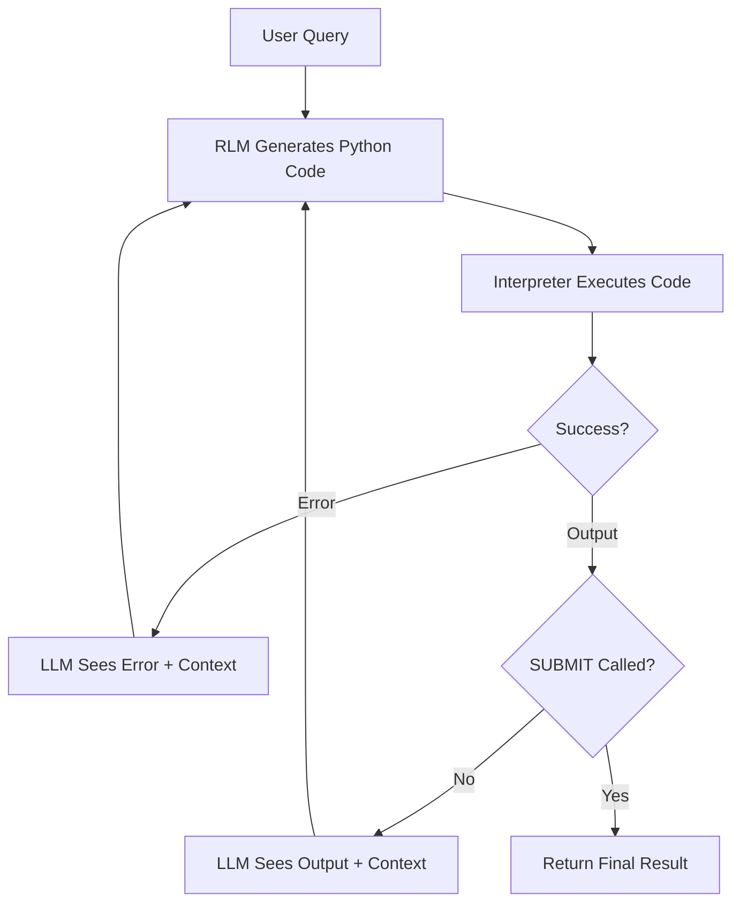

Traditional AI agents use a simple loop: think, pick a tool, call it, repeat. But what if we could let the LLM write actual Python code that calls tools directly? That's what DSPy's RLM (Reinforcement Language Model) module enables, and when combined with MCP's code execution mode, it becomes remarkably powerful.

## The Problem with Traditional Tool Calling

Most agent frameworks (including DSPy's ReAct) follow a rigid pattern:

```
Thought: I need to search for users
Action: search_users
Action Input: {"name": "john"}
Observation: [results...]
Thought: Now I need to get details...
```

This works, but it's **limiting**:

- **One tool per step**: Can't chain multiple calls efficiently
- **No data manipulation**: Can't filter, transform, or combine results
- **Rigid format**: The LLM must conform to a strict thought/action/observation structure
- **Expensive**: Each tool call requires a full LLM round-trip

## Enter RLM: Code Generation Instead of Tool Selection

RLM flips the paradigm. Instead of asking the LLM to choose which tool to call, we ask it to **write Python code** that accomplishes the task:

```python
# Instead of pick-one-tool-at-a-time, the LLM writes:
users = await server.search_users(name="john")
active_users = [u for u in users if u['status'] == 'active']
details = await server.get_user_details(user_id=active_users[0]['id'])
SUBMIT(result=f"Found {len(active_users)} active users. First: {details['name']}")
```

This is more natural, more flexible, and often more efficient.

## How RLM Works

RLM follows an iterative refinement process:



Key points:
1. **Signature**: Defines inputs/outputs, like `task -> result`
2. **Interpreter**: Executes the generated code (sandboxed)
3. **Iteration**: If code fails or doesn't call `SUBMIT()`, RLM shows the output to the LLM and asks it to try again
4. **SUBMIT()**: A special function the LLM calls to signal "I'm done, here's my answer"

## The MCP code_mode Magic

Here's where it gets interesting. The [mcp_use](https://github.com/mcp-use/mcp-use) library has a feature called `code_mode` that creates a sandboxed Python environment where MCP tools are available as async functions:

```python
client = MCPClient(config="config.json", code_mode=True)

# Tools become callable as:
result = await server_name.tool_name(param1=value1, param2=value2)
```

This means the LLM can write code like:

```python
# Query a database
incidents = await log_analytics.execute_kql(
    kql_query="SecurityIncident | where Severity == 'High' | take 10"
)

# Process locally
for incident in incidents['data']:
    print(f"Incident {incident['id']}: {incident['title']}")

# Submit findings
SUBMIT(result=f"Found {len(incidents['data'])} high-severity incidents")
```

## The MCPCodeInterpreter: Bridging RLM and MCP

To connect RLM with MCP's code execution, we need a custom interpreter. Here's the core implementation:

```python
class MCPCodeInterpreter:
    """Custom CodeInterpreter that executes code via mcp_use."""

    def __init__(self, mcp_client: MCPClient):
        self.client = mcp_client
        self._started = False

    def _inject_submit_function(self, code: str) -> str:
        """Inject SUBMIT so the LLM can signal completion."""
        submit_func = '''
def SUBMIT(**kwargs):
    return {"__submit__": kwargs}
'''
        return submit_func + "\n" + code

    def execute(self, code: str, variables: dict | None = None) -> Any:
        """Execute code and return results for RLM."""
        code = self._inject_submit_function(code)

        # Execute via mcp_use's sandbox
        result = self._run_async(self.client.execute_code(code))

        # Check if LLM called SUBMIT
        if isinstance(result.get('result'), dict) and '__submit__' in result['result']:
            return FinalOutput(result['result']['__submit__'])

        # Otherwise, return output for next iteration
        return self._format_output(result)
```

The key insight: we inject a `SUBMIT()` function that returns a special marker. When we see this marker in the output, we know the LLM is done and return a `FinalOutput` to RLM.

## Key Components Explained

### 1. The SUBMIT() Pattern

The `SUBMIT()` function is how the LLM signals "I have the answer":

```python
# LLM generates this code:
data = await server.fetch_data(query="...")
analysis = process_data(data)
SUBMIT(result=f"Analysis complete: {analysis}")
```

Without `SUBMIT()`, the code output goes back to the LLM for another iteration. This lets the LLM explore, gather data across multiple iterations, and only commit when ready.

### 2. Variable Scoping

Important: variables don't persist between code executions. Each `execute()` call is a fresh environment. The LLM must do everything in a single code block:

```python
# WRONG - variables don't persist:
# Block 1: data = await server.fetch()
# Block 2: SUBMIT(result=data)  # Error: 'data' not defined!

# CORRECT - everything in one block:
data = await server.fetch()
SUBMIT(result=data)
```

### 3. Error Handling

When code fails, RLM shows the error to the LLM:

```
Error: NameError: name 'foo' is not defined
```

The LLM can then fix its code and try again. This iterative refinement is powerful—the LLM learns from its mistakes within the same task.

## Putting It All Together

Here's a minimal working example:

```python
import dspy
from mcp_use import MCPClient

# Configure LLM
dspy.configure(lm=dspy.LM("openai/gpt-4o"))

# Setup
client = MCPClient(config="config.json", code_mode=True)
await client.create_all_sessions()

# Create interpreter
interpreter = MCPCodeInterpreter(client)

# Build signature with tool info
signature = build_rlm_signature(namespaces, tools_description)

# Create and run RLM
rlm = dspy.RLM(
    signature=signature,
    interpreter=interpreter,
    max_iterations=10
)

result = await rlm.aforward(task="Find high-severity incidents")
print(result.result)
```

## RLM vs ReAct: When to Use Each

| Aspect | ReAct | RLM |
|--------|-------|-----|
| **Approach** | Pick one tool per step | Write code that calls tools |
| **Flexibility** | Rigid format | Full Python expressiveness |
| **Multi-step** | One tool at a time | Chain calls in single block |
| **Data processing** | Limited | Full Python capabilities |
| **Debugging** | Easier to trace | Requires reading code |
| **Best for** | Simple workflows | Complex data gathering |

**Use ReAct when:**
- Simple, linear tool chains
- You want explicit reasoning traces
- Tools are straightforward

**Use RLM when:**
- Complex queries requiring data manipulation
- Multiple related tool calls
- You trust the LLM to write correct code

## Lessons Learned

After building several agents with RLM + MCP, here are the key takeaways:

1. **Clear tool documentation matters**: The LLM can only write good code if it knows what tools exist and their parameters.

2. **SUBMIT() clarity is crucial**: Make it very clear in the signature when and how to call `SUBMIT()`. Otherwise, the LLM might just print results.

3. **Variable scope trips up LLMs**: Repeatedly remind the LLM that variables don't persist. It's the most common error.

4. **Iteration limits need tuning**: Too few iterations and complex tasks fail. Too many and simple tasks waste tokens.

5. **Print statements help**: Encourage the LLM to use `print()` for intermediate results. This helps both debugging and gives context for the next iteration.

## Conclusion

DSPy's RLM module combined with MCP's code execution mode is a powerful pattern for building flexible AI agents. Instead of constraining the LLM to a rigid tool-calling format, we let it write actual code—giving it the full expressiveness of Python while maintaining the safety of sandboxed execution.

The key innovation is the MCPCodeInterpreter bridge: it takes RLM's code generation capabilities and connects them to real tools via MCP. The `SUBMIT()` pattern provides a clean way for the LLM to signal completion.

For complex tasks involving multiple data sources, filtering, and aggregation, RLM significantly outperforms traditional ReAct-style agents. The tradeoff is less visibility into reasoning—but when you need power over interpretability, RLM delivers.

---

*Full example code available on [GitHub](https://github.com/yourusername/rlm-mcp-example).*
