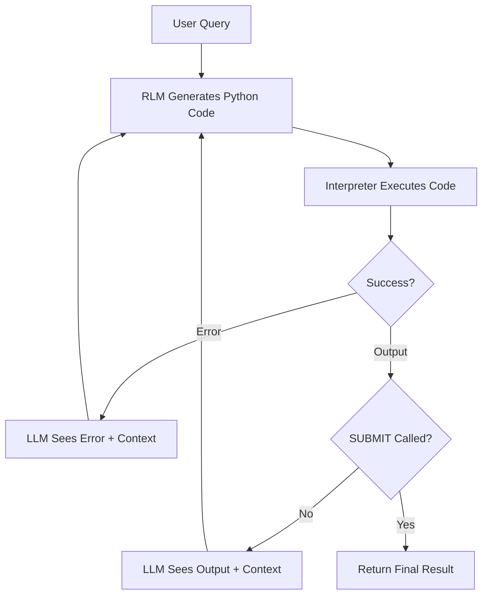

DSPy's RLM (Reinforcement Language Model) module lets LLMs write Python code instead of picking tools one at a time. Combined with mcp_use's `code_mode`, this creates a powerful pattern: the LLM writes code that directly calls MCP tools as async Python functions.

## The Traditional Approach

Most agent frameworks (including DSPy's ReAct) follow a rigid pattern:

```
Thought: I need to search for users
Action: search_users
Action Input: {"name": "john"}
Observation: [results...]
Thought: Now I need to get details...
```

This works, but it's **limiting**:

- **One tool per step**: Can't chain multiple calls efficiently
- **No data manipulation**: Can't filter, transform, or combine results
- **Rigid format**: The LLM must conform to a strict thought/action/observation structure
- **Expensive**: Each tool call requires a full LLM round-trip, and the output feeds back through the LLM just to be copied to the next call

## The Origin of Code Mode

The code mode concept was pioneered by [Cloudflare](https://blog.cloudflare.com/code-mode/) with a key insight: **LLMs have seen a lot of code, but they haven't seen a lot of "tool calls."**

Traditional tool-calling relies on synthetic training data and special tokens that are unfamiliar to language models. But LLMs have been trained on millions of open-source projects—they're *really good* at writing code. So why not let them?

Cloudflare's approach converts MCP tool schemas into a TypeScript API, then asks the LLM to write code that calls that API. The code runs in a secure V8 isolate sandbox where the only external access is through the MCP bindings. This gives you:

- **Better tool handling**: Agents manage more tools when presented as APIs
- **Efficient chaining**: No LLM round-trip between tool calls
- **Security**: API keys stay hidden in the bindings

## mcp-use's Python Implementation

The [mcp-use](https://mcp-use.com/docs/python/client/code-mode) library brings code mode to Python. Enable it with a single flag:

```python
client = MCPClient(config="config.json", code_mode=True)
```

When enabled, something clever happens: instead of loading all tool definitions into the agent's context (which can be 150,000+ tokens), the agent sees only two tools: `execute_code` and `search_tools`. All MCP tools become accessible *inside* the code execution environment as async functions:

```python
# Tools are namespaced by server
result = await github.get_pull_request(owner="anthropics", repo="claude")
data = await log_analytics.execute_kql(kql_query="SecurityAlert | take 10")
```

Tool names are automatically sanitized to valid Python identifiers (`list-files` becomes `list_files`).

The **progressive discovery** pattern is powerful: rather than pre-loading everything, agents use `search_tools(query)` to find relevant tools on-demand. This reduces context from 150k tokens to ~2k tokens—a **98.7% reduction**.

## Enter RLM: Code Generation Instead of Tool Selection

RLM flips the paradigm. Instead of asking the LLM to choose which tool to call, we ask it to **write Python code** that accomplishes the task:

```python
# Instead of pick-one-tool-at-a-time, the LLM writes:
users = await server.search_users(name="john")
active_users = [u for u in users if u['status'] == 'active']
details = await server.get_user_details(user_id=active_users[0]['id'])
SUBMIT(result=f"Found {len(active_users)} active users. First: {details['name']}")
```

This is more natural, more flexible, and often more efficient.

## How RLM Works

RLM follows an iterative refinement process:



Key points:
1. **Signature**: Defines inputs/outputs, like `task -> result`
2. **Interpreter**: Executes the generated code (sandboxed)
3. **Iteration**: If code fails or doesn't call `SUBMIT()`, RLM shows the output to the LLM and asks it to try again
4. **SUBMIT()**: A special function the LLM calls to signal "I'm done, here's my answer"

## Combining RLM with MCP Code Mode

Here's where it comes together. RLM needs a custom interpreter to execute the code it generates. mcp-use's code mode provides exactly that—a sandboxed environment where MCP tools are async functions.

The LLM can write code like:

```python
# Query a database
incidents = await log_analytics.execute_kql(
    kql_query="SecurityIncident | where Severity == 'High' | take 10"
)

# Process locally
for incident in incidents['data']:
    print(f"Incident {incident['id']}: {incident['title']}")

# Submit findings
SUBMIT(result=f"Found {len(incidents['data'])} high-severity incidents")
```

## The MCPCodeInterpreter: Bridging RLM and MCP

To connect RLM with MCP's code execution, we need a custom interpreter. Here's the core implementation:

```python
class MCPCodeInterpreter:
    """Custom CodeInterpreter that executes code via mcp_use."""

    def __init__(self, mcp_client: MCPClient):
        self.client = mcp_client
        self._started = False

    def _inject_submit_function(self, code: str) -> str:
        """Inject SUBMIT so the LLM can signal completion."""
        submit_func = '''
def SUBMIT(**kwargs):
    return {"__submit__": kwargs}
'''
        return submit_func + "\n" + code

    def execute(self, code: str, variables: dict | None = None) -> Any:
        """Execute code and return results for RLM."""
        code = self._inject_submit_function(code)

        # Execute via mcp_use's sandbox
        result = self._run_async(self.client.execute_code(code))

        # Check if LLM called SUBMIT
        if isinstance(result.get('result'), dict) and '__submit__' in result['result']:
            return FinalOutput(result['result']['__submit__'])

        # Otherwise, return output for next iteration
        return self._format_output(result)
```

The key insight: we inject a `SUBMIT()` function that returns a special marker. When we see this marker in the output, we know the LLM is done and return a `FinalOutput` to RLM.

## Key Components Explained

### 1. The SUBMIT() Pattern

The `SUBMIT()` function is how the LLM signals "I have the answer":

```python
# LLM generates this code:
data = await server.fetch_data(query="...")
analysis = process_data(data)
SUBMIT(result=f"Analysis complete: {analysis}")
```

Without `SUBMIT()`, the code output goes back to the LLM for another iteration. This lets the LLM explore, gather data across multiple iterations, and only commit when ready.

### 2. Variable Scoping

Important: variables don't persist between code executions. Each `execute()` call is a fresh environment. The LLM must do everything in a single code block:

```python
# WRONG - variables don't persist:
# Block 1: data = await server.fetch()
# Block 2: SUBMIT(result=data)  # Error: 'data' not defined!

# CORRECT - everything in one block:
data = await server.fetch()
SUBMIT(result=data)
```

### 3. Error Handling

When code fails, RLM shows the error to the LLM:

```
Error: NameError: name 'foo' is not defined
```

The LLM can then fix its code and try again. This iterative refinement is powerful—the LLM learns from its mistakes within the same task.

## Putting It All Together

Here's a minimal working example:

```python
import dspy
from mcp_use import MCPClient

# Configure LLM
dspy.configure(lm=dspy.LM("openai/gpt-4o"))

# Setup
client = MCPClient(config="config.json", code_mode=True)
await client.create_all_sessions()

# Create interpreter
interpreter = MCPCodeInterpreter(client)

# Build signature with tool info
signature = build_rlm_signature(namespaces, tools_description)

# Create and run RLM
rlm = dspy.RLM(
    signature=signature,
    interpreter=interpreter,
    max_iterations=10
)

result = await rlm.aforward(task="Find high-severity incidents")
print(result.result)
```

## RLM vs ReAct: When to Use Each

| Aspect | ReAct | RLM |
|--------|-------|-----|
| **Approach** | Pick one tool per step | Write code that calls tools |
| **Flexibility** | Rigid format | Full Python expressiveness |
| **Multi-step** | One tool at a time | Chain calls in single block |
| **Data processing** | Limited | Full Python capabilities |
| **Debugging** | Easier to trace | Requires reading code |
| **Best for** | Simple workflows | Complex data gathering |

**Use ReAct when:**
- Simple, linear tool chains
- You want explicit reasoning traces
- Tools are straightforward

**Use RLM when:**
- Complex queries requiring data manipulation
- Multiple related tool calls
- You trust the LLM to write correct code

## Lessons Learned

After building several agents with RLM + MCP, here are the key takeaways:

1. **Clear tool documentation matters**: The LLM can only write good code if it knows what tools exist and their parameters.

2. **SUBMIT() clarity is crucial**: Make it very clear in the signature when and how to call `SUBMIT()`. Otherwise, the LLM might just print results.

3. **Variable scope trips up LLMs**: Repeatedly remind the LLM that variables don't persist. It's the most common error.

4. **Iteration limits need tuning**: Too few iterations and complex tasks fail. Too many and simple tasks waste tokens.

5. **Print statements help**: Encourage the LLM to use `print()` for intermediate results. This helps both debugging and gives context for the next iteration.

## Conclusion

DSPy's RLM module combined with mcp-use's code mode is a powerful pattern. The insight from Cloudflare—that LLMs are better at writing code than making tool calls—plus mcp-use's Python implementation of code mode, plus DSPy's iterative refinement loop creates something greater than the sum of its parts.

The MCPCodeInterpreter bridges RLM and MCP: it takes generated code, executes it in mcp-use's sandbox where tools are async functions, and returns results for the next iteration. The `SUBMIT()` pattern provides a clean way to signal completion.

For complex tasks involving multiple data sources, filtering, and aggregation, this approach significantly outperforms traditional ReAct-style agents. The tradeoff is less visibility into reasoning—but when you need power over interpretability, code mode delivers.

## References

- [Cloudflare: Code Mode](https://blog.cloudflare.com/code-mode/) - The original code mode concept
- [mcp-use: Code Mode Documentation](https://mcp-use.com/docs/python/client/code-mode) - Python implementation
- [DSPy RLM Documentation](https://dspy.ai/) - DSPy's Reinforcement Language Model
