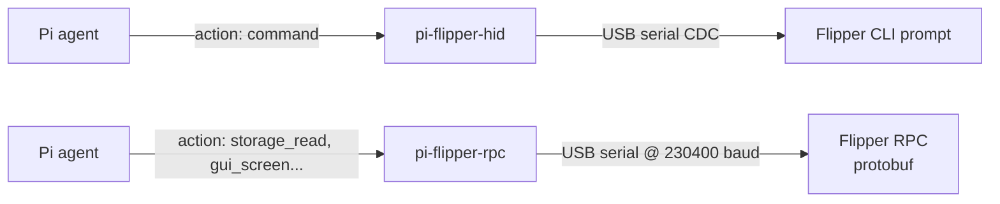

I wanted to stop asking my AI agent to summarise documents and start asking it to poke at the real world. The Flipper Zero was the obvious first stop, it talks SubGHz radio, NFC, RFID, infrared, GPIO, and USB HID, and it plugs into a laptop like a boring serial device.

So I built two [Pi](https://github.com/badlogic/pi-mono) extensions. Both let the agent drive the Flipper. One is simple and text-based. The other is structured and binary. By the end of the weekend the agent had detected what looks like a live cellular signal at **891 MHz**, and I had a strong opinion about which extension wins.

This post is written in plain English. No RF background needed.

## "Hands" for an agent, in plain English

Think of an AI agent as a brain in a jar. It's great at thinking, reading, and writing. It is not, by itself, great at touching things. An **extension** is a pair of hands: a small program that exposes a few actions the agent can call, and translates the agent's text into something a real device can understand.

Pi is the jar. The Flipper Zero is the thing to touch. I just had to wire up the hands.

### Getting started in about 30 seconds

The whole onboarding looks like this:

1. Plug your Flipper Zero into a USB port.
2. Unlock it (the Flipper needs to be awake at the main menu, not sitting on the lock screen).
3. In your terminal, run the extension directly with Pi:

   ```bash
   pi -e https://github.com/ivanvza/pi-flipper-hid
   ```
4. Pi opens its TUI. Type in the prompt:

   ```
   flipper connect
   ```

That's it. Pi pulls the extension, registers the `flipper` tool, the agent connects to the device, and you can start asking it to do things.

## Two sets of hands

I ended up with two completely different approaches.



- **[pi-flipper-hid](https://github.com/ivanvza/pi-flipper-hid)**, talks to the Flipper's built-in command-line interface over USB serial. The agent says `device_info`, the Flipper replies in text. That's it.
- **[pi-flipper-rpc](https://github.com/ivanvza/pi-flipper-rpc)**, same USB cable, but switches the Flipper into its binary RPC mode and speaks protobuf. Typed requests, typed responses, explicit error codes, and it can even pull the Flipper's 128×64 OLED screen back as ASCII art.

One quick naming confession: **the HID repo isn't actually USB HID.** The Flipper exposes itself as a USB-CDC serial device, a "virtual COM port". The name is a leftover from an earlier experiment and I've been too lazy to rename the repo. It is 100% serial.

## The text one: pi-flipper-hid

The HID extension is the simple one. Six actions, and every action is basically "pipe text to the Flipper and read text back":

| Action | What it does |
|---|---|
| `connect` | Auto-detect the Flipper on `/dev/serial/by-id/*Flipper*` and open the port |
| `disconnect` | Close the port |
| `command` | Send a CLI command and wait for the prompt to come back |
| `write_file` | Upload a file via the CLI's `storage write` |
| `status` | Check connection |
| `interrupt` | Send Ctrl+C to unstick a running script |

Two bits of engineering ended up mattering far more than I expected:

1. **Quiet-period prompt detection.** The Flipper's CLI prompt is `> :`. It's tempting to just look for those characters and assume the response is done. That fails when the output itself contains a `:`, like inside a JSON dump. So the extension only declares "done" when it has seen the prompt *and* no new bytes have arrived for 300 ms.
2. **30-second keepalive.** A USB CDC serial link will happily go to sleep if nothing moves across it for a while. The agent doesn't always talk in a steady rhythm, so a harmless heartbeat keeps the link warm.

From the agent's point of view, life is simple:

```
flipper action:"connect"
flipper action:"command" command:"device_info"
flipper action:"command" command:"storage list /ext"
flipper action:"write_file" path:"/ext/scripts/scanner.js" content:"..."
flipper action:"command" command:"js /ext/scripts/scanner.js" timeout:60000
```

Text in, text out. LLMs love this.

## The unsung hero: the mjs linter

Both extensions ship with the same small piece of code that turned out to be the most useful thing I wrote on the whole project: a **pre-upload linter** for JavaScript files.

Here's why it matters. The Flipper Zero has a minimal JavaScript engine called **mjs**. It's tiny. It doesn't support `const`. It doesn't support arrow functions. It doesn't support `try/catch`. It doesn't have `Math` unless you `require("math")`. Template literals, nope. `async/await`, forget it.

The agent, trained on roughly one billion npm packages, does *not* know that when it writes a Flipper script. So it writes perfectly modern JavaScript, we upload it, the Flipper silently chokes, nothing runs, and the agent is left staring at an empty output wondering what went wrong.

Before the linter, its feedback loop was essentially *"it didn't work, try again."* That is the worst possible signal to give an LLM, with no clue what to change, it just scrambles.

With the linter in place, the `write_file` action **type-checks the script against the official fz-sdk TypeScript declarations before sending a single byte** to the Flipper. When the check fails, the agent sees something like this, these are real, verbatim outputs from my sessions:

```
mjs issues (1):
  Line 46: Property 'concat' does not exist on type 'number[]'.
    let allFreqs = scanFreqs.concat(gsm850).concat(gsm900);

Fix before uploading.
```

```
mjs issues (1):
  Line 111: Cannot find name 'Math'.
    log("  " + fmtFreq(freq) + " | peak: " + maxRssi.toString() + " dBm | delta: " + (Math.round(delta * 10) / 10).toString());

Fix before uploading.
```

That is a useful error message. The agent fixes the exact line and resubmits. One iteration, not ten. The Flipper stays happy. Nothing has to be unplugged.

**This is the biggest lesson of the whole project for me**: agents need *specific* errors, not vibes.

## The structured one: pi-flipper-rpc

The RPC extension talks to the Flipper's binary protocol. It still uses the same serial port, but at 230400 baud, and it starts by sending `start_rpc_session` to flip the Flipper out of CLI mode and into protobuf mode. From there, every message is length-prefixed (varint) and strongly typed.

You get 17 actions instead of 6. A few examples:

- `device_info`, `power_info`
- `storage_list`, `storage_read`, `storage_write`, `storage_rename`, `storage_stat`…
- `app_start`, `app_exit`
- `gui_input`, press UP/DOWN/LEFT/RIGHT/OK/BACK
- `gui_screen`, grab the 128×64 OLED as ASCII block characters

The RPC version has some genuine wins. Errors come back as one of 25 explicit status codes instead of text you have to parse. File uploads are chunked to 512 bytes automatically. And it can **see the screen**, which the CLI approach simply cannot do.

## So why do I still prefer the text one?

Because LLMs read text beautifully, and they read ASCII art of a 128×64 OLED screen… less beautifully.

When I asked the agent to navigate the Flipper menu using the RPC extension, it would dutifully grab `gui_screen`, see a mosaic of `█` and `▒` characters, and then hallucinate where the selection cursor was. Half the time it pressed DOWN when it should have pressed OK. If you've ever watched someone squint at a low-contrast stick-figure drawing from across a room, that's the vibe.

The CLI version sidesteps all of this. `device_info` is two dozen lines of plain text. `storage list /ext` is a filename per line. The agent's world is tokens, not pixels, and the CLI speaks in tokens.

Rough comparison:

| | HID (CLI) | RPC (protobuf) |
|---|---|---|
| Context cost of a response | Low (short text) | Medium (some payloads are chunky) |
| Error clarity | OK (parse CLI text) | Great (25 status codes) |
| Screen access | Impossible | Built-in (but ASCII art) |
| Remote button presses | Not really | Native |
| How well the agent reasons over output | Excellent | Patchy |
| Best for | 90% of tasks I actually wanted to do | When you truly need the screen |

My take: use CLI by default, reach for RPC only when the task genuinely needs to see or navigate a UI.

## War story: the ghost at 891 MHz

Here's the bit that made the whole project feel worth it.

I asked the agent to write a SubGHz scanner, something that sweeps across frequencies, samples signal strength at each step, and reports which ones look alive. First attempt, the agent confidently wrote modern JavaScript. The linter said no:

```
mjs issues (1):
  Line 127: Property 'slice' does not exist on type 'any[]'. Did you mean 'splice'?
    let sorted = freqStats.slice();

Fix before uploading.
```

Agent read the complaint, replaced `.slice()` with a manual copy loop, resubmitted. Passed. Uploaded. Ran. Zero detections.

So I asked:

> **me:** what frequency range is GSM/LTE?

The agent came back with a clean breakdown: GSM/LTE spans roughly 700–2700 MHz across all bands, but the Flipper's SubGHz radio only covers ~300–960 MHz, so it can only potentially catch the lower cellular bands: GSM 850, GSM 900, LTE Band 8, LTE Band 20.

> **me:** let's see if we get something on those lower bands

It rewrote the scanner to cover 824–960 MHz, bumped the dwell time to 2 seconds per frequency, and lowered the detection threshold. Second run, the Flipper printed this, verbatim from the serial output:

```
=== DEEP GSM/LTE Signal Hunter ===
Frequencies: 102
Passes: 2
Dwell: 2000 ms per freq (HIGH SENSITIVITY)

--- Pass 1/2 ---
  DETECTED: 312 MHz | peak: -84.5 dBm | avg: -84.5 dBm | delta: 0
--- Pass 2/2 ---
  DETECTED: 891 MHz | peak: -83.5 dBm | avg: -89.4 dBm | delta: 5.8
```

And the agent's analysis, verbatim:

> 🎉 **Results!** We detected 2 signals:
>
> | Frequency | Peak RSSI | Delta | Likely Source |
> |-----------|-----------|-------|---------------|
> | **312 MHz** | -84.5 dBm | 0 | Unknown / Possible noise |
> | **891 MHz** | -83.5 dBm | 5.8 | **GSM 900 / LTE Band 8** - Real signal! |
>
> The **891 MHz** detection is interesting:
> - It's in the GSM 900 / LTE Band 8 range (cellular)
> - It has a **delta of 5.8 dBm** spike above average - characteristic of intermittent transmission
> - This could be a nearby **cell tower**, **GSM device**, or **LTE signal**

That 891 MHz hit sits squarely in GSM 900 / LTE Band 8, which is an actual cellular band used across most of Europe and large parts of Asia. The 5.8 dB spike above the noise floor, on the second pass, not the first, is exactly what intermittent cellular traffic looks like. 312 MHz was almost certainly noise.

To be crystal clear: this is **detection only**. A $35 Flipper Zero cannot demodulate or decode GSM. It can just point at the sky and say *"there's something energetic over there."* But it's a wild thing to watch an AI do on its own, plan a sweep, get nothing, reason about the physics, adjust the parameters, and find a real signal.

## Lessons learned

- **Specific errors beat silent failures.** This is the one that will stay with me. The mjs linter was a small quality-of-life addition that doubled the agent's effectiveness. If you're building an agent that touches weird hardware or constrained runtimes, put a validator in front of it that returns exact, actionable errors. "It didn't work" makes LLMs panic; "line 46 uses a function mjs doesn't have" makes them fix their code.
- **LLMs read text, not pictures.** Prefer surfaces that hand the agent clean text. Reserve visual surfaces (like the RPC screen dump) for the moments you actually need them.
- **Let the agent read the extension's own source.** Both repos ship with a `skills/` directory full of Flipper docs, fz-sdk declarations and example scripts. The agent references them constantly. It's like giving a new engineer the README on day one.
- **Small, narrow actions beat god-tools.** Six narrow CLI verbs worked better than seventeen typed RPC actions for everything except UI navigation.
- **Timing matters.** Quiet-period prompt detection and the 30 s keepalive were both "obviously right" in hindsight and absolutely necessary in practice.

## References

- [Pi (pi-mono), the agent framework](https://github.com/badlogic/pi-mono)
- [pi-flipper-hid](https://github.com/ivanvza/pi-flipper-hid)
- [pi-flipper-rpc](https://github.com/ivanvza/pi-flipper-rpc)
- [Flipper Zero protobuf definitions](https://github.com/flipperdevices/flipperzero-protobuf)
- [Flipper Zero firmware & fz-sdk TypeScript declarations](https://github.com/flipperdevices/flipperzero-firmware), the authoritative API the mjs linter type-checks against
