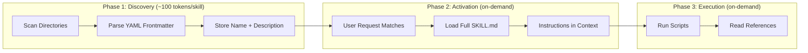
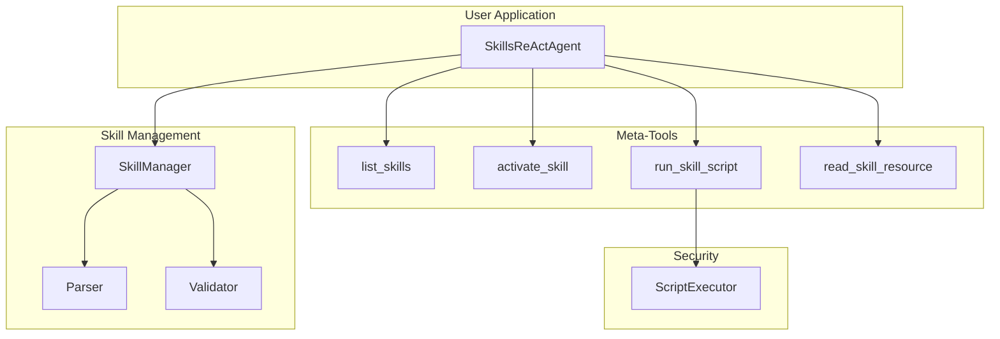

Anthropic recently released their [Agent Skills specification](https://agentskills.io), a framework for teaching AI agents new capabilities through modular, reusable skill packages. It's the backbone of Claude Code's extensibility. We successfully replicated this architecture in DSPy, and in this post, I'll break down how it works and what we learned.

## The Problem with Monolithic Prompts

When you build an LLM agent, you typically stuff everything into a system prompt:

```
You are a helpful assistant that can:
- Search the web
- Read files
- Run shell commands
- Query databases
- Generate reports
- ... 50 more things
```

This approach has problems:

- **Context explosion**: Every capability eats tokens, even when unused
- **Maintenance nightmare**: Adding features means editing one massive prompt
- **No composability**: Can't share capabilities across projects
- **Brittle**: One bad instruction can break unrelated features

Anthropic's solution? **Progressive disclosure through skills**.

## What Are Agent Skills?

A skill is a self-contained directory that teaches an agent how to do something specific:

```
network-check/
├── SKILL.md              # Metadata + instructions
├── scripts/
│   ├── ping_host.py
│   └── check_port.py
└── references/
    └── troubleshooting.md
```

The magic is in the `SKILL.md` file:

```yaml
---
name: network-check
description: Network connectivity testing toolkit for checking host reachability, port availability, and DNS resolution. Use when diagnosing network issues or verifying service availability.
allowed-tools: Bash(ping:*) Bash(nmap:*)
---

# Network Connectivity Check

When the user needs to diagnose network issues, follow this decision tree:

1. **Basic connectivity**: Run `ping_host.py` first
2. **Port check**: If host responds, use `check_port.py` for specific services
3. **DNS issues**: If hostname doesn't resolve, check DNS configuration

## Available Scripts

- `ping_host.py <host>` - Check if host is reachable
- `check_port.py <host> <port>` - Test specific port connectivity
```

The key insight: **the agent doesn't load the full instructions until it needs them**.

## Progressive Disclosure Architecture

This is what makes skills efficient:



**Phase 1**: At startup, only metadata is loaded. 10 skills = ~1000 tokens, not 50,000.

**Phase 2**: When a user asks something that matches a skill's description, the agent activates it and loads full instructions.

**Phase 3**: Scripts execute without loading their source code into context. References are read only when needed.

This mirrors how humans work. You don't hold every procedure manual in working memory—you know *what* you can do, and look up *how* when needed.

## Our DSPy Implementation

We built [dspy-skills](https://github.com/navcore/dspy-skills), a full implementation of the Agent Skills spec for DSPy's ReAct agents. Here's the architecture:



### The Core Classes

**SkillManager** handles the lifecycle:

```python
class SkillManager:
    def __init__(self, skill_directories: list[Path]):
        self.skills: dict[str, LoadedSkill] = {}
        self.skill_directories = skill_directories

    def discover(self) -> list[LoadedSkill]:
        """Scan directories for SKILL.md files, load only metadata."""
        for directory in self.skill_directories:
            for skill_path in directory.glob("*/SKILL.md"):
                metadata = parse_frontmatter(skill_path)
                self.skills[metadata["name"]] = LoadedSkill(
                    name=metadata["name"],
                    description=metadata["description"],
                    path=skill_path.parent,
                    state=SkillState.DISCOVERED,
                    instructions=None  # Not loaded yet!
                )
        return list(self.skills.values())

    def activate(self, name: str) -> str:
        """Load full instructions for a skill."""
        skill = self.skills[name]
        skill.instructions = read_instructions(skill.path / "SKILL.md")
        skill.state = SkillState.ACTIVATED
        return skill.instructions
```

**LoadedSkill** tracks state:

```python
@dataclass
class LoadedSkill:
    name: str
    description: str
    path: Path
    state: SkillState  # DISCOVERED or ACTIVATED
    instructions: Optional[str]

    @property
    def scripts_dir(self) -> Path:
        return self.path / "scripts"

    @property
    def references_dir(self) -> Path:
        return self.path / "references"
```

### Meta-Tools: How the Agent Interacts

We give the agent four tools to interact with skills:

| Tool | Purpose | When Used |
|------|---------|-----------|
| `list_skills()` | Show available skills | Agent needs to know what it can do |
| `activate_skill(name)` | Load full instructions | Task matches a skill's description |
| `run_skill_script(skill, script, args)` | Execute bundled code | Following skill instructions |
| `read_skill_resource(skill, type, file)` | Read reference docs | Needs additional context |

Here's how `activate_skill` works:

```python
def create_activate_skill_tool(manager: SkillManager) -> Callable:
    def activate_skill(skill_name: str) -> str:
        """Activate a skill to get its full instructions.

        Args:
            skill_name: Name of the skill to activate

        Returns:
            The skill's full instructions and available resources
        """
        try:
            instructions = manager.activate(skill_name)
            skill = manager.get_skill(skill_name)

            # Build response with instructions and available resources
            response = f"# {skill_name} - Activated\n\n"
            response += instructions + "\n\n"

            # List available scripts
            if skill.scripts_dir.exists():
                scripts = list(skill.scripts_dir.glob("*"))
                if scripts:
                    response += "## Available Scripts\n"
                    for s in scripts:
                        response += f"- {s.name}\n"

            return response

        except SkillNotFoundError:
            return f"Error: Skill '{skill_name}' not found"

    return activate_skill
```

### Secure Script Execution

Skills can include executable scripts. This is powerful but dangerous. Our `ScriptExecutor` enforces security:

```python
class ScriptExecutor:
    ALLOWED_INTERPRETERS = {"python3", "bash", "sh", "node"}
    DEFAULT_TIMEOUT = 30

    def __init__(self, config: ScriptConfig):
        self.timeout = config.timeout
        self.sandbox_enabled = config.sandbox

    def run(self, script_path: Path, args: list[str]) -> ExecutionResult:
        # 1. Validate script exists and is within skill directory
        if not self._is_safe_path(script_path):
            raise SecurityError("Path traversal detected")

        # 2. Determine interpreter from shebang or extension
        interpreter = self._get_interpreter(script_path)
        if interpreter not in self.ALLOWED_INTERPRETERS:
            raise SecurityError(f"Interpreter not allowed: {interpreter}")

        # 3. Build command
        cmd = [interpreter, str(script_path)] + args

        # 4. Optional sandboxing (firejail on Linux)
        if self.sandbox_enabled and shutil.which("firejail"):
            cmd = ["firejail", "--quiet", "--private"] + cmd

        # 5. Execute with timeout
        result = subprocess.run(
            cmd,
            capture_output=True,
            timeout=self.timeout,
            env=self._sanitized_env()
        )

        return ExecutionResult(
            stdout=result.stdout.decode(),
            stderr=result.stderr.decode(),
            exit_code=result.returncode
        )
```

Key security measures:
- **Path validation**: Scripts must be inside their skill directory
- **Interpreter allowlist**: Only python3, bash, sh, node
- **Timeout enforcement**: Default 30 seconds, prevents runaway processes
- **Optional sandboxing**: Firejail isolation on Linux
- **Environment sanitization**: Only PATH and PYTHONPATH passed through

### Putting It Together

Here's how you use it:

```python
import dspy
from dspy_skills import SkillsReActAgent, SkillsConfig

# Configure DSPy with your LLM
dspy.configure(lm=dspy.LM("anthropic/claude-sonnet-4-20250514"))

# Load skills from directories
config = SkillsConfig(
    skill_directories=["./skills", "~/.skills"],
    scripts={"enabled": True, "sandbox": True, "timeout": 30}
)

# Create the agent
agent = SkillsReActAgent(
    signature="request: str -> response: str",
    config=config
)

# Use it
result = agent(request="Check if api.example.com port 443 is accessible")
```

The agent's internal reasoning:

```
Thought: User wants to check network connectivity. Let me see what skills are available.
Action: list_skills()
Observation: Available skills:
  - network-check: Network connectivity testing toolkit...
  - file-utils: File operations and management...

Thought: network-check matches this task. Let me activate it.
Action: activate_skill("network-check")
Observation: # network-check - Activated
  [Full instructions loaded]
  Available Scripts: ping_host.py, check_port.py

Thought: I should use check_port.py for this specific request.
Action: run_skill_script("network-check", "check_port.py", "api.example.com 443")
Observation: Port 443 on api.example.com is OPEN (response time: 45ms)

Thought: I have the answer.
Action: finish("Port 443 on api.example.com is accessible...")
```

## Lessons Learned

### 1. Descriptions Are Everything

The skill description is how the agent decides what to activate. Bad descriptions = wrong skill selection.

**Bad**: "Network utilities"
**Good**: "Network connectivity testing toolkit for checking host reachability, port availability, and DNS resolution. Use when diagnosing network issues or verifying service availability."

Include:
- What the skill does
- When to use it
- Key capabilities as keywords

### 2. Progressive Disclosure Actually Works

We tested with 20+ skills. Without progressive disclosure, context usage was ~40K tokens at startup. With it, ~2K tokens. The agent activates 1-2 skills per task on average.

### 3. Scripts > Generated Code

It's tempting to let the agent generate code on the fly. Don't. Bundled scripts are:
- Tested and reliable
- Secure (no arbitrary code execution)
- Consistent (same behavior every time)
- Auditable (you can review them)

### 4. Tool Restrictions Reduce Errors

The `allowed-tools` field in SKILL.md restricts what tools the agent can use when a skill is active:

```yaml
allowed-tools: Bash(python:*) Bash(nmap:*) Read
```

This prevents the agent from going off-script. If a network skill is active, it can't suddenly start editing files.

## Comparison to Anthropic's Implementation

| Feature | Anthropic (Claude Code) | Our DSPy Implementation |
|---------|------------------------|------------------------|
| Skill format | SKILL.md + YAML frontmatter | Identical |
| Progressive disclosure | Yes | Yes |
| Script execution | Yes (sandboxed) | Yes (firejail optional) |
| Tool restrictions | `allowed-tools` field | `allowed-tools` field |
| Forked context | Yes (`context: fork`) | Not yet implemented |
| Model override | Yes (`model` field) | Not yet implemented |
| Hooks | PreToolUse, PostToolUse, Stop | Not yet implemented |

We've implemented the core specification. The advanced features (forked contexts, hooks) are on the roadmap.

## What's Next

This implementation is open source. We're working on:

1. **Skill marketplace**: Share and discover community skills
2. **Forked contexts**: Run complex skills in isolated sub-agents
3. **Skill composition**: Skills that use other skills
4. **Evaluation framework**: Automated testing for skill quality

The Agent Skills pattern is powerful because it's simple. A directory, a markdown file, and some scripts. No complex frameworks, no proprietary formats. Just files that teach agents what they can do.

---

**Resources**:
- [Agent Skills Specification](https://agentskills.io)
- [Anthropic's Engineering Blog Post](https://www.anthropic.com/engineering/equipping-agents-for-the-real-world-with-agent-skills)
- [Claude Code Skills Documentation](https://docs.anthropic.com/en/docs/claude-code/skills)
- [Our DSPy Implementation](https://github.com/navcore/dspy-skills)
